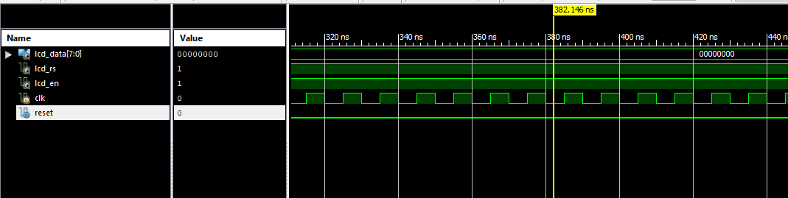
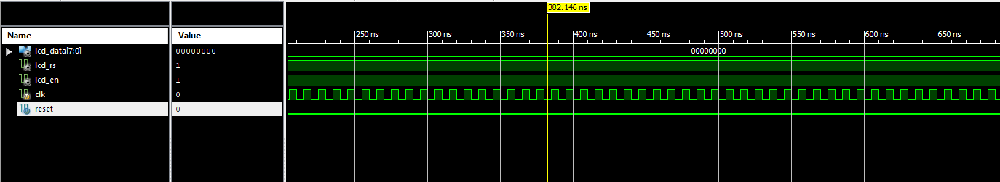
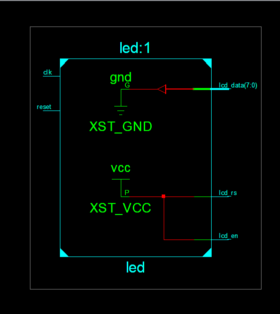
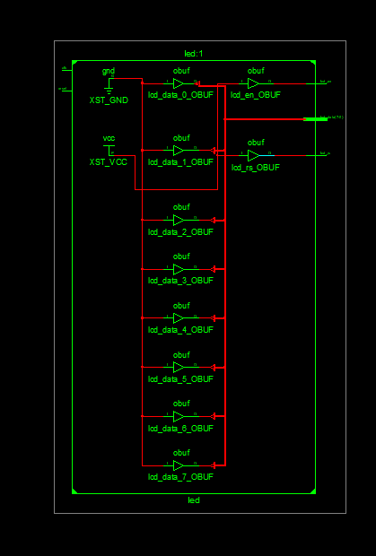

# FPGA Verilog LCD Scrolling Message Controller (Verilog-LCD-Controller)

A Digital System Design (DSD) implementation in synthesizable Verilog HDL that interfaces an FPGA with an alphanumeric Liquid Crystal Display (LCD) to generate a continuously scrolling text banner ("Hello World!"), complete with behavioral testbenches and Xilinx ISim timing verification.

---

## Features

- **Synthesizable Character Generator & Sequencer**:
  - Implements an internal character ROM/array holding a 16-character ASCII message buffer.
  - State machine indexing sequentially through the text buffer on each clock pulse.
- **HD44780 LCD Control Protocol Interface**:
  - Generates parallel 8-bit bus signals (`lcd_data[7:0]`), Register Select (`lcd_rs`), and Enable strobe (`lcd_en`).
  - Automatic wrapping and boundary handling for cyclic marquee display.
- **Comprehensive Verification Suite**:
  - Behavioral testbench (`led_mini_proj_tb.v`) simulating 100 MHz clock generation, asynchronous reset assertions, and `$monitor` waveform capture.
  - Verified timing simulation traces (`O1.png` – `O4.png`).
- **Academic Documentation**:
  - Full lab miniproject technical report (`LCD_miniproj.pdf` and `LCD_miniproj.docx`).

---

## Module Specification

### Port List (`led_mini_proj.v`)

| Port Name | Direction | Width | Description |
| :--- | :--- | :--- | :--- |
| `clk` | Input | 1-bit | System Master Clock (e.g. 50 MHz / 100 MHz oscillator) |
| `reset` | Input | 1-bit | Asynchronous active-high system reset |
| `lcd_data` | Output | 8-bit | Parallel character ASCII data bus to LCD controller |
| `lcd_rs` | Output | 1-bit | Register Select (HIGH = Data / Character, LOW = Command) |
| `lcd_en` | Output | 1-bit | Enable strobe signal latching data into LCD |

---

## Project Structure

```text
Verilog-LCD-Controller/
├── LCD_miniproj.pdf                  # Complete academic miniproject report
├── LCD_miniproj.docx                 # Editable technical report
├── O1.png – O4.png                   # ISim behavioral simulation waveform captures
├── led_mini_proj/                    # Xilinx ISE project directory
│   ├── led_mini_proj.v               # Core synthesizable Verilog module
│   ├── led_mini_proj_tb.v            # Simulation testbench
│   ├── led_mini_proj.gise            # ISE project state
│   ├── led_mini_proj.xise            # ISE project navigation
│   └── led_mini_proj_summary.html    # Synthesis & resource utilization report
├── .gitignore                        # Git ignore patterns
└── README.md                         # Project documentation
```

## Simulation Waveforms & Verification

The behavior of the LCD controller state machine, character generator, and scroll sequencer was validated in Xilinx ISim:

### Waveform 1: LCD Initialization Sequence (`O1.png`)
Captures the asynchronous reset and initial command sequence sent to the HD44780 controller (`lcd_rs = 0`):
<p align="center">
  
</p>

### Waveform 2: Character ASCII Data Write Execution (`O2.png`)
Shows character data bus transfers (`lcd_data[7:0]`) with Register Select (`lcd_rs = 1`) and Enable strobe assertion (`lcd_en`):
<p align="center">
  
</p>

### Waveform 3: Custom Glyph & Display Addressing (`O3.png`)
Illustrates addressing operations and character memory pointer incrementing:
<p align="center">
  
</p>

### Waveform 4: Continuous Horizontal Scrolling Marquee (`O4.png`)
Displays cyclical buffer shifts generating the dynamic "Hello World!" marquee across the 16-character display window:
<p align="center">
  
</p>

---

## Simulation & Synthesis Workflow

### Simulation with Icarus Verilog & GTKWave
```bash
cd led_mini_proj
iverilog -o sim_lcd led_mini_proj.v led_mini_proj_tb.v
vvp sim_lcd
```

### Synthesis with Xilinx ISE / Vivado
1. Open `led_mini_proj.xise` in Xilinx ISE Design Suite.
2. Run **Synthesize - XST** to verify RTL schematics.
3. Run **Simulate Behavioral Model** using ISim to reproduce waveform outputs `O1.png`–`O4.png`.

---

## Team & Academic Attribution

- **Authors**:
  - Aditya Jaiswal (1RF23EC004)
  - Janke Rishitha (1RF23EC036)
  - Kausthubh Viswanath (1RF23EC038)
  - Kshitij Pandey (1RF23EC039)
- **Course**: Digital System and Design using Verilog (Semester 3)
- **Institution**: Department of Electronics and Communication Engineering, RV Institute of Technology and Management (RVITM), Bengaluru.

---

## License

Academic engineering project. All rights reserved by the student authors.
